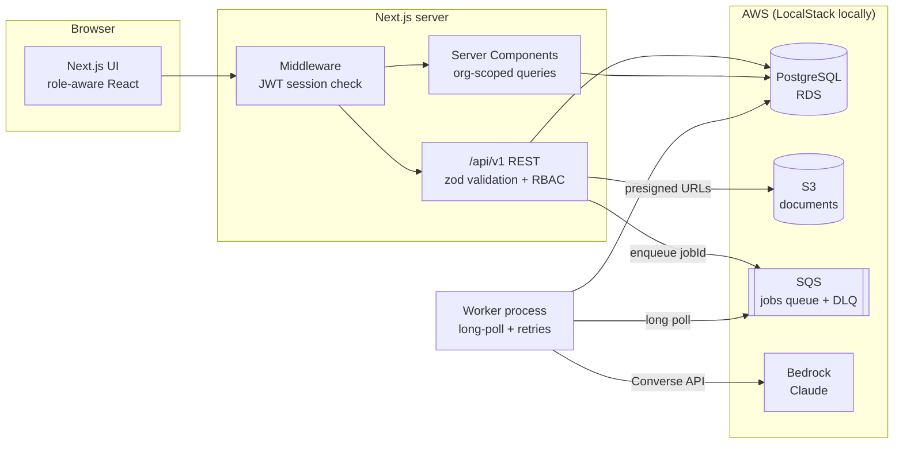
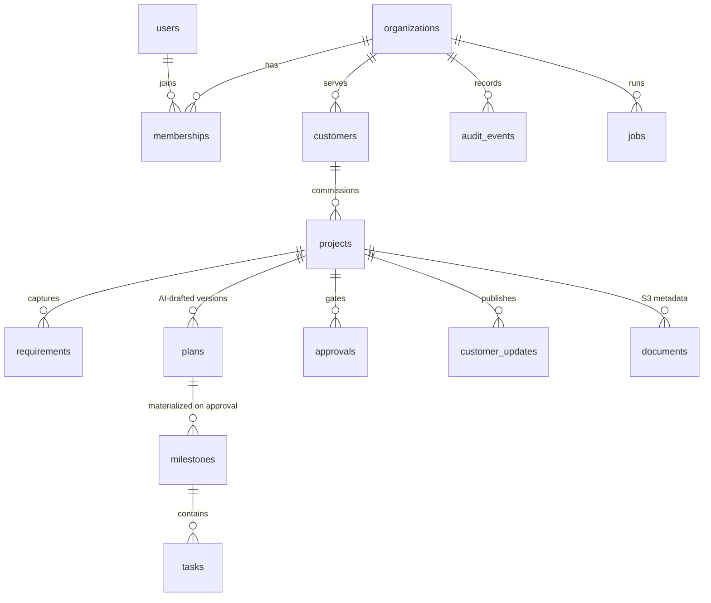
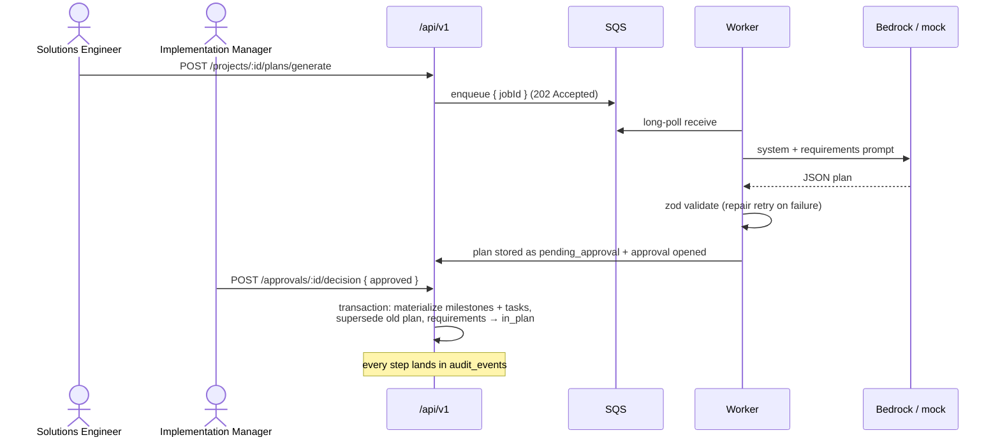

# Enterprise AI Implementation Workbench

[](https://github.com/BMcCarthy96/enterprise-ai-implementation-workbench/actions/workflows/ci.yml)

A multi-tenant internal platform for software implementation teams: it turns messy customer requirements into AI-drafted implementation plans, routes every AI output through **human approval**, materializes approved plans into milestone/task delivery boards, and keeps a complete audit trail — on an **AWS-native backbone** (PostgreSQL, S3, SQS, Bedrock) that runs 100% locally via Docker + LocalStack with zero cloud cost.

> **TL;DR demo flow:** capture requirements → queue an AI scoping job (SQS → worker → Bedrock/Claude) → schema-validated plan lands in the approval queue → an implementation manager approves it → milestones & tasks appear on the delivery board → an AI-drafted customer status update goes through the same approval gate before the customer role can see it → everything is in the audit log.

## Who this is for

| Persona | What they get |
|---|---|
| **Operations Admin** | Member management, full visibility, job operations |
| **Implementation Manager** | Delivery ownership; the human checkpoint that approves/rejects every AI-generated plan and customer update |
| **Solutions Engineer** | Requirements intake, plan generation, task board, drafts — but *cannot* approve their own AI output |
| **Customer Stakeholder** | Read-only external view: project status and *published* updates only |

## Architecture



**Key decisions (and why):**

- **DB row = source of truth for jobs; SQS message = delivery only.** Messages carry just a `jobId`. Duplicate delivery (SQS is at-least-once) is harmless because the worker claims jobs with an atomic `queued → running` transition. All observability lives in Postgres, surfaced on the Ops page.
- **AI output never acts on its own.** Plan generation stores a `pending_approval` plan and opens an approval. Only a human decision materializes milestones/tasks. Customer updates follow the same gate — nothing reaches the customer role without sign-off.
- **Closed feedback loop.** When a plan is rejected, the reviewer's reason code + note are captured and — with one checkbox, on by default — a revised generation is queued automatically, carrying that feedback into the next prompt; the resulting version records what feedback it addressed. A per-version diff (milestones added/removed, task/risk deltas) makes re-approval fast. This is the loop the Insights dashboard then measures.
- **Model output is validated, not trusted.** Responses must parse as JSON and pass a zod schema (`PlanContentSchema`); one repair attempt feeds validation errors back to the model; a second failure fails the job into the retry/backoff path (5s → 10s → 20s… capped) and eventually a dead-letter state with a manual retry button.
- **Prompt-injection hygiene.** User-authored text (requirement notes, etc.) is embedded as JSON inside an `<input_json>` envelope the model is told to treat as data; the envelope extraction is robust to close-tag smuggling (covered by a unit test that caught a real bug during development).
- **The local/cloud switch is one env var.** All AWS SDK v3 clients read `AWS_ENDPOINT_URL`; set it to LocalStack for development, drop it in production and the SDK resolves real endpoints + IAM credentials. `AI_PROVIDER=mock|bedrock` swaps a deterministic offline provider for Claude on Bedrock.
- **Tenant isolation is enforced in one place.** Every session carries an `orgId`; every project-owned resource lookup goes through `requireProject`/`requireTask`/… helpers that scope by org, so a guessed UUID from another tenant 404s. S3 keys are namespaced `orgs/{orgId}/projects/{projectId}/…` and registration validates the prefix.

## Data model



14 tables, all tenant-scoped by `org_id`. `audit_events` is append-only; `plans` are versioned (approve v2 → v1 becomes `superseded`).

## The approval workflow (sequence)



## Stack

Next.js 16 (App Router) · TypeScript · PostgreSQL + Drizzle ORM · AWS SDK v3 (S3, SQS, Bedrock Runtime) · zod · jose (JWT sessions) · bcryptjs · pino · Vitest · Playwright · GitHub Actions · Docker Compose + LocalStack

## Getting started

Prereqs: Node 20+, Docker Desktop.

```bash
cp .env.example .env          # defaults target local Docker/LocalStack
docker compose up -d          # Postgres :5433 + LocalStack :4566 (S3, SQS + DLQ auto-provisioned)
npm install
npm run db:migrate            # apply Drizzle migrations
npm run db:seed               # two demo tenants with realistic history
npm run dev                   # app on http://localhost:3000
npm run worker                # background job worker (second terminal)
```

Sign in with any demo account (password `demo1234`):

| Email | Role |
|---|---|
| `admin@northwind.dev` | Operations Admin |
| `manager@northwind.dev` | Implementation Manager |
| `engineer@northwind.dev` | Solutions Engineer |
| `customer@brightlane.dev` | Customer Stakeholder |
| `admin@cascade.dev` | Admin of a second tenant (isolation demo) |

**Suggested demo:** sign in as `engineer` → open *Patient Onboarding Portal* → Plan tab → *Generate implementation plan* (watch the job go queued → running on the Ops page) → sign in as `manager` → Approvals → review & approve → Board tab now has the materialized tasks → Updates tab → *Draft customer update* → approve it → sign in as `customer@brightlane.dev` to see exactly what an external stakeholder sees.

## Global search

A **⌘K / Ctrl+K command palette** (in the sidebar of every authenticated page) searches projects, requirements, and customers in one keystroke — debounced, keyboard-navigable, and org-scoped. Result types are gated by role in the same place the API is: a customer stakeholder can only ever match projects, never the customer directory or internal requirements. The query logic lives behind [`GET /api/v1/search`](src/app/api/v1/search/route.ts), with the role-gating and wildcard-escaping helpers unit-tested in isolation.

## API

The REST surface is documented as OpenAPI 3.1 generated **from the same zod schemas the handlers validate with** — docs can't drift from behavior: [`GET /api/openapi.json`](http://localhost:3000/api/openapi.json).

Auth is a `workbench_session` httpOnly cookie (HS256 JWT, 12h). Async operations (plan generation, digests) return `202 { jobId }`; poll `GET /api/v1/jobs`.

## Testing & CI

```bash
npm test          # 53 unit tests: RBAC, plan schema, prompt envelope, backoff, sessions, mock provider, insights aggregations, plan diff, search gating, regeneration guard
npm run test:e2e  # Playwright: auth, RBAC, seeded flows, feedback loop + diff + auto-regenerate, insights, global search, health, CSV export, OpenAPI contract
E2E_WORKER=1 npx playwright test  # + full async generate→approve→board flow (needs worker running)
```

GitHub Actions runs lint, typecheck, unit tests, and build, plus the Playwright suite against a real Postgres service container on every push/PR ([.github/workflows/ci.yml](.github/workflows/ci.yml)).

## Insights & evals

An **Insights** dashboard (`/insights`, admin + manager only) turns the audit and job data into a quality/observability view — the difference between "AI demo" and "AI in production":

- **AI output quality:** plan approval rate, avg approval turnaround, generation success rate, avg latency
- **Rejection-reason breakdown:** the reviewer reason codes captured on every rejection — the signal that drives prompt iteration
- **Quality by prompt version:** approval outcomes grouped by the `promptVersion` stamped on each plan, so output drift is attributable as prompts evolve
- **Delivery health:** projects by stage, tasks by status, requirements/plans/updates volume

The aggregation math lives in pure, unit-tested functions in [`src/server/services/insights.ts`](src/server/services/insights.ts) — verifiable without a database.

## Reliability & operability

- Exponential backoff retries with SQS delayed delivery; attempts tracked per job
- Dead-letter parking after `maxAttempts`, surfaced in the UI with one-click manual retry (audited)
- Atomic job claiming → duplicate SQS deliveries are no-ops
- Structured pino logs with request IDs on every API call and job attempt
- Uniform JSON error envelope (`{ error, requestId }`) with zod issue details on 400s
- Seeded failure state (a throttled dead-letter job) so the ops story is visible in the demo
- `GET /api/health` — public liveness/readiness probe reporting database and queue status independently (200 healthy / 503 degraded), ready for an App Runner / ECS health check
- Audit trail exportable as CSV (`GET /api/v1/audit/export`, same RBAC as the audit page) for offline review / compliance

## Deploying to real AWS

See [docs/aws-deployment.md](docs/aws-deployment.md) for the full path: RDS + S3 + SQS + Bedrock model access + App Runner/ECS, IAM policies, and what changes (spoiler: env vars, not code).

## Repo tour

```
src/
  app/               # Next.js App Router: (app) authenticated shell + /api routes
  components/        # shared UI primitives
  db/                # Drizzle schema + client (14 tables)
  lib/
    ai/              # provider abstraction: bedrock.ts, mock.ts, prompts, plan schema
    auth/            # sessions (jose), passwords (bcrypt), RBAC matrix
    aws/             # SDK v3 clients, S3 presign helpers, SQS helpers
  server/services/   # org-scoped business logic + audit writer
  worker/            # SQS-polling job worker (retries, DLQ)
scripts/             # seed script, LocalStack init
tests/               # unit (Vitest) + e2e (Playwright)
docs/                # architecture, AWS deployment, case study
```

## Lessons learned

- **Schema-validate every model response.** The repair-retry loop (feed zod errors back once) converts most "almost right" outputs into valid ones without human noise; everything else fails loudly into the retry path.
- **A regex is an attack surface.** The `<input_json>` envelope originally used a non-greedy close-tag match; a unit test simulating close-tag smuggling broke it. Greedy matching to the builder's own final tag fixed it — the test now pins the behavior.
- **Separating "AI drafts" from "humans decide" simplifies everything.** Because generation never mutates delivery state, retries and regenerations are free — only the approval transaction has side effects, and it's idempotent-guarded (409 on double-decision).
- **Pointing SDK clients at LocalStack from day one** meant the AWS integration was exercised on every dev loop, not discovered broken at deploy time.
