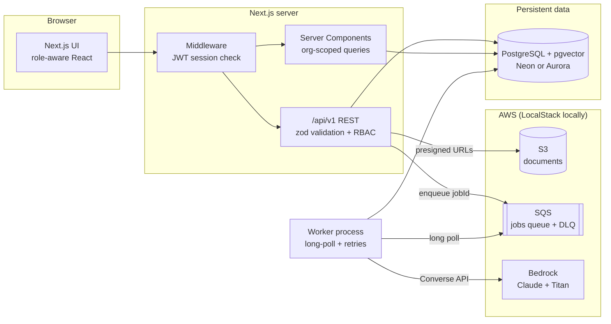
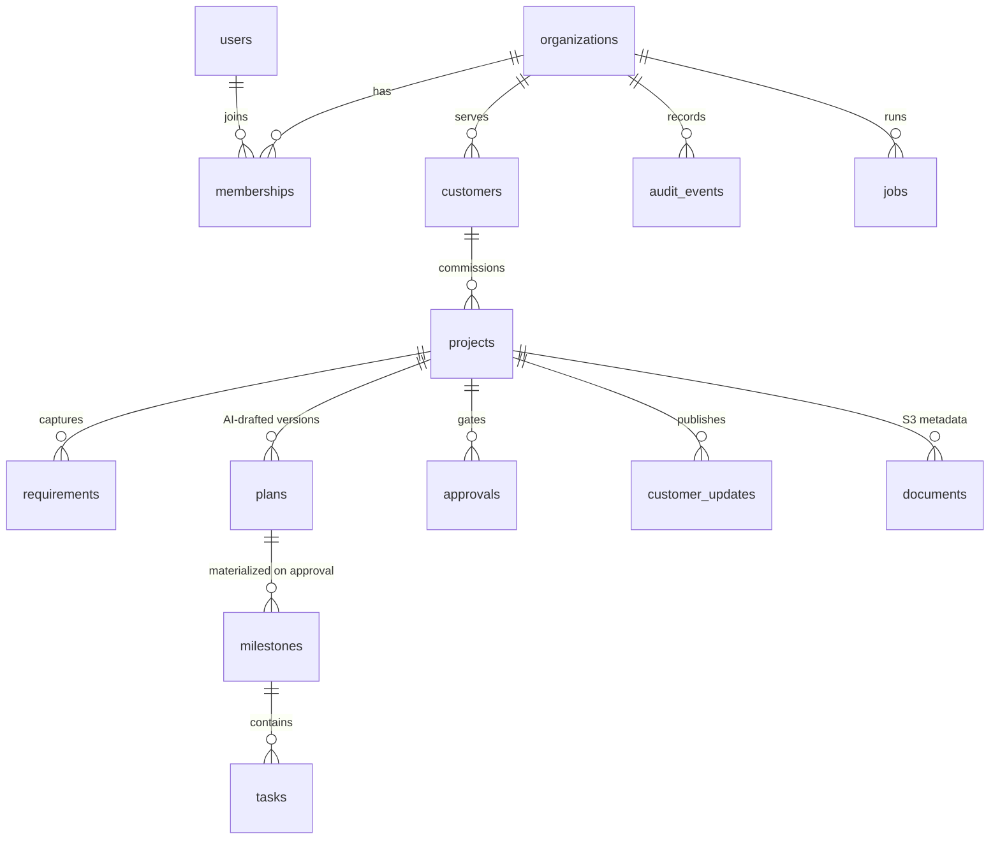
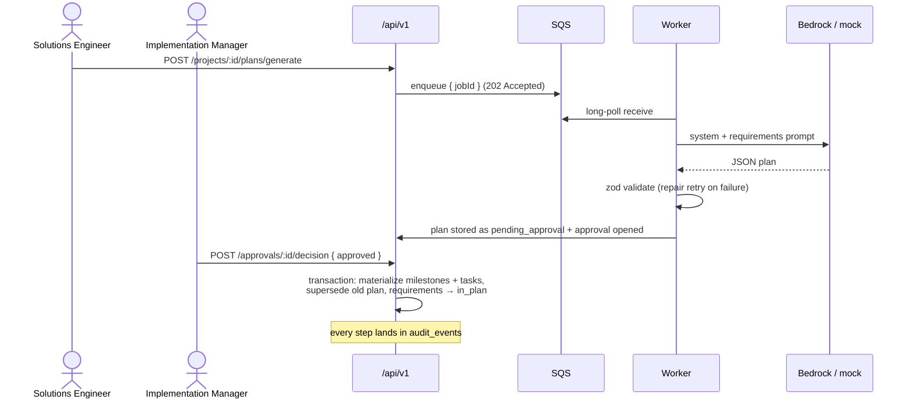

# Enterprise AI Implementation Workbench

[](https://github.com/BMcCarthy96/enterprise-ai-implementation-workbench/actions/workflows/ci.yml)

A multi-tenant internal platform for software implementation teams: it turns messy customer requirements into AI-drafted implementation plans, routes every AI output through **human approval**, materializes approved plans into milestone/task delivery boards, and keeps a complete audit trail — on an **AWS-native backbone** (PostgreSQL, S3, SQS, Bedrock) that runs 100% locally via Docker + LocalStack with zero cloud cost.

> **TL;DR demo flow:** capture requirements → ground an AI scoping job with tenant-filtered document chunks → trace generation, validation, repair, cost, and citations → route the plan to a human approval queue → materialize approved milestones/tasks → keep every decision in the audit log.

## Review it in 60 seconds

1. Run `docker compose up -d`, `npm run db:migrate`, and `npm run db:seed`.
2. Start `npm run dev` and `npm run worker` in separate terminals.
3. Open `/` and choose **Start 90-second tour**. The isolated tour links directly to the AI evidence packet, approval boundary, materialized delivery, customer-safe view, and dead-letter recovery.
4. Open `/proof` for the machine-readable claim registry and `/proof/case-study` for the decision narrative.

The public demo is synthetic by design. Every evidence packet identifies whether it is a fixture, deterministic mock run, or live provider observation; no synthetic fixture is presented as production telemetry.

The public journey has three entry points: **Start 90-second tour** for the
short delivery story, **5-minute technical tour** for retrieval, role
switching, and failure recovery, and **Explore self-guided demo** for the full
isolated workspace. All three provision the same expiring synthetic boundary;
the checkpoint only controls where the guided walkthrough opens.
The sign-in page also includes an **Open demo workspace** action, so a visitor
can enter the sample workspace without an account or password.

## Who this is for

| Persona | What they get |
|---|---|
| **Operations Admin** | Member management, full visibility, job operations |
| **Implementation Manager** | Delivery ownership; the human checkpoint that approves/rejects every AI-generated plan and customer update |
| **Solutions Engineer** | Requirements intake, plan generation, task board, drafts — but *cannot* approve their own AI output |
| **Customer Stakeholder** | Read-only external view: project status and *published* updates only |

## Features

**Requirements → AI implementation plans**
- Structured requirements intake per project (title, detail, priority, lifecycle status)
- Plan generation runs as a **background job** (SQS → worker → Bedrock/Claude, or a deterministic offline mock) and returns `202 { jobId }` — the UI polls, nothing blocks
- Model output must parse as JSON *and* pass a zod schema before it is persisted, with one automatic repair attempt that feeds the validation errors back to the model
- Plans are **versioned**; approving v2 supersedes v1, and each version carries the `promptVersion` it was generated under

**Human-in-the-loop approval**
- Every AI artifact — plans *and* customer updates — lands in an approval queue; generation never mutates delivery state, only a human decision does
- Rejections capture a **reason code + note**, which feed the next regeneration's prompt automatically (the closed feedback loop the Insights dashboard then measures); the revised version records the feedback it addressed
- **Per-version diff** (milestones added/removed, task/risk deltas) so re-approval doesn't mean re-reading the whole plan
- **Bulk decisions** across a selection, with partial-success reporting instead of all-or-nothing rollback
- Double-decision attempts are rejected with a `409`

**Delivery execution**
- Approved plans materialize into **milestones and tasks** in one transaction
- Kanban-style board with status transitions, assignees, and priorities
- Document uploads straight to **S3 via presigned URLs**, with org/project-namespaced keys
- PDF, DOCX, TXT, and Markdown ingestion with idempotent chunking, pgvector HNSW retrieval, PII redaction, and validated `S1…S8` citations

**Visibility & reporting**
- [**SLA & delivery risk**](#sla--delivery-risk) on the dashboard — at-risk/breached projects with the signal that tripped, plus **per-project threshold overrides**
- [**Insights & evals**](#insights--evals) — approval rate, generation success rate, latency, rejection-reason breakdown, and quality grouped by prompt version
- **AI Evidence Center** — sanitized, clickable evidence packets for retrieval, generation, repair, automated checks, grounding coverage, approval decisions, tokens, pricing, and latency
- [**Customer-facing timeline**](#customer-facing-status-timeline) — external progress view built from an allowlist of customer-safe sources, so internal review history can't leak
- [**Global search**](#global-search) — ⌘K palette over projects, requirements, and customers, role-gated server-side
- **Append-only audit log** of every mutation, filterable in-app and exportable as CSV

**Platform**
- **Multi-tenant** by construction: every session carries an `orgId`, every lookup is org-scoped, and PostgreSQL RLS repeats that guarantee inside a transaction-local `app.org_id`
- **RBAC** across four roles, enforced on API routes, server components, and navigation alike
- [**Reliability**](#reliability--operability): exponential-backoff retries, dead-letter parking with one-click retry, atomic job claiming, structured logs, health probe
- **Guarded public demo** — an ephemeral synthetic workspace with TTL, quotas, spend circuit breakers, four seeded persona identities, and a persistent one-click role switcher; no shared credentials or production impersonation
- **Operable enterprise controls** — Settings surfaces for memberships, OIDC, SCIM, signed webhooks, and retention use the same guarded APIs as the product
- [**OpenAPI 3.1 docs**](#api) generated from shared Zod contracts where handlers validate them, with route coverage checked in CI
- Runs **100% locally** on Docker + LocalStack; the switch to real AWS is env vars, not code

## Architecture


```mermaid
flowchart LR
    subgraph Browser
      UI[Next.js UI<br/>role-aware React]
    end
    subgraph "Next.js server"
      MW[Middleware<br/>JWT session check]
      API["/api/v1 REST<br/>zod validation + RBAC"]
      SC[Server Components<br/>org-scoped queries]
    end
    subgraph "Persistent data"
      PG[(PostgreSQL + pgvector<br/>Neon or Aurora)]
    end
    subgraph "AWS (LocalStack locally)"
      S3[(S3<br/>documents)]
      SQS[[SQS<br/>jobs queue + DLQ]]
      BR[Bedrock<br/>Claude + Titan]
    end
    W[Worker process<br/>long-poll + retries]

    UI --> MW --> API
    MW --> SC
    API --> PG
    SC --> PG
    API -- presigned URLs --> S3
    API -- enqueue jobId --> SQS
    W -- long poll --> SQS
    W --> PG
    W -- Converse API --> BR
```

**Key decisions (and why):**

- **DB row = source of truth for jobs; SQS message = delivery only.** Messages carry just a `jobId`. Publication runs only after the job transaction commits; `dispatched_at` plus a scheduled reconciler repairs transient publish failures. Duplicate delivery (SQS is at-least-once) is safe because workers claim queued work with a lease, heartbeat it during execution, and reclaim expired running jobs. Attempts and failure reasons remain visible on the Ops page.
- **AI output never acts on its own.** Plan generation stores a `pending_approval` plan and opens an approval. Only a human decision materializes milestones/tasks. Customer updates follow the same gate — nothing reaches the customer role without sign-off.
- **Bulk review without hiding failures.** A reviewer can apply one decision across a selection (`POST /api/v1/approvals/bulk`). Each item stays an independent audited transaction, so a stale selection — someone else already decided one — yields a *partial success* report (`succeeded[]` / `failed[]` / summary) instead of rolling back the reviewer's other valid decisions. Fan-out is capped at 50 ids per request since each rejection can queue a regeneration.
- **Closed feedback loop.** When a plan is rejected, the reviewer's reason code + note are captured and — with one checkbox, on by default — a revised generation is queued automatically, carrying that feedback into the next prompt; the resulting version records what feedback it addressed. A per-version diff (milestones added/removed, task/risk deltas) makes re-approval fast. This is the loop the Insights dashboard then measures.
- **Model output is validated, not trusted.** Responses must parse as JSON and pass a zod schema (`PlanContentSchema`); one repair attempt feeds validation errors back to the model; a second failure fails the job into the retry/backoff path (5s → 10s → 20s… capped) and eventually a dead-letter state with a manual retry button.
- **Prompt-injection hygiene.** User-authored text (requirement notes, etc.) is embedded as JSON inside an `<input_json>` envelope the model is told to treat as data; the envelope extraction is robust to close-tag smuggling (covered by a unit test that caught a real bug during development).
- **The local/cloud switch is configuration-only.** All AWS SDK v3 clients read `AWS_ENDPOINT_URL`; set it to LocalStack for development, drop it in production and the SDK resolves real endpoints + IAM credentials. `AI_PROVIDER=mock|bedrock|anthropic` selects the deterministic offline provider, Claude on Bedrock, or the direct Anthropic adapter.
- **Tenant isolation is enforced in one place.** Every session carries an `orgId`; every project-owned resource lookup goes through `requireProject`/`requireTask`/… helpers that scope by org, so a guessed UUID from another tenant 404s. S3 keys are namespaced `orgs/{orgId}/projects/{projectId}/…` and registration validates the prefix.

## Data model


```mermaid
erDiagram
    organizations ||--o{ memberships : has
    users ||--o{ memberships : joins
    organizations ||--o{ customers : serves
    customers ||--o{ projects : commissions
    projects ||--o{ requirements : captures
    projects ||--o{ plans : "AI-drafted versions"
    plans ||--o{ milestones : "materialized on approval"
    milestones ||--o{ tasks : contains
    projects ||--o{ approvals : gates
    projects ||--o{ customer_updates : publishes
    projects ||--o{ documents : "S3 metadata"
    organizations ||--o{ audit_events : records
    organizations ||--o{ jobs : runs
```

29 tables, with tenant-owned delivery, AI observability, retrieval, citations, enterprise controls, and ephemeral demo workspace data. `audit_events` is append-only; `plans` are versioned (approve v2 → v1 becomes `superseded`).

## The approval workflow (sequence)


```mermaid
sequenceDiagram
    actor SE as Solutions Engineer
    actor IM as Implementation Manager
    participant API as /api/v1
    participant Q as SQS
    participant W as Worker
    participant AI as Bedrock / mock

    SE->>API: POST /projects/:id/plans/generate
    API->>Q: enqueue { jobId } (202 Accepted)
    W->>Q: long-poll receive
    W->>AI: system + requirements prompt
    AI-->>W: JSON plan
    W->>W: zod validate (repair retry on failure)
    W->>API: plan stored as pending_approval + approval opened
    IM->>API: POST /approvals/:id/decision { approved }
    API->>API: transaction: materialize milestones + tasks,<br/>supersede old plan, requirements → in_plan
    Note over API: every step lands in audit_events
```

## Stack

Next.js 16 (App Router) · TypeScript · PostgreSQL + Drizzle ORM · AWS SDK v3 (S3, SQS, Bedrock Runtime) · zod · jose (JWT sessions) · bcryptjs · pino · Vitest · Playwright · GitHub Actions · Docker Compose + LocalStack

## Getting started

Prereqs: Node 20+, Docker Desktop.

```bash
cp .env.example .env          # defaults target local Docker/LocalStack
docker compose up -d          # pgvector Postgres :5433 + LocalStack :4566 (S3, SQS + DLQ auto-provisioned)
npm install
npm run db:migrate            # apply Drizzle migrations
npm run db:seed               # two demo tenants with realistic history
npm run dev                   # app on http://localhost:3000
npm run worker                # background job worker (second terminal)
npm run eval:offline          # deterministic 15-case contract regression gate (including retrieval on/off)
npm run infra:install && npm run infra:synth  # CDK template validation
npm run capture:evidence                     # deterministic 1440×900 screenshots
npm run capture:video                        # repeatable silent recruiter walkthrough (WebM)
```

Sign in with any demo account (password `demo1234`):

| Email | Role |
|---|---|
| `admin@northwind.dev` | Operations Admin |
| `manager@northwind.dev` | Implementation Manager |
| `engineer@northwind.dev` | Solutions Engineer |
| `customer@brightlane.dev` | Customer Stakeholder |
| `admin@cascade.dev` | Admin of a second tenant (isolation demo) |

**Suggested demo:** use the landing page’s **Start 90-second tour** button. The isolated workspace opens the guided walkthrough once with a checklist that moves through the dashboard health view → grounded Order Intake plan → repaired AI trace → Claims approval → live Patient Onboarding generation → delivery materialization → dead-letter recovery → customer communication. Minimize/reopen the dock at any time, or use **Reset** to provision a fresh scenario. For persona-specific access, sign in as `engineer` → open *Patient Onboarding Portal* → Plan tab → *Generate implementation plan* (watch the job go queued → running on the Ops page) → sign in as `manager` → Approvals → review & approve → Delivery now has the materialized tasks → Communications → *Draft customer update* → approve it → sign in as `customer@brightlane.dev` to see exactly what an external stakeholder sees.

## Global search

A **⌘K / Ctrl+K command palette** (in the sidebar of every authenticated page) searches projects, requirements, and customers in one keystroke — debounced, keyboard-navigable, and org-scoped. Result types are gated by role in the same place the API is: a customer stakeholder can only ever match projects, never the customer directory or internal requirements. The query logic lives behind [`GET /api/v1/search`](src/app/api/v1/search/route.ts), with the role-gating and wildcard-escaping helpers unit-tested in isolation.

## API

The REST surface is documented as OpenAPI 3.1 from the shared request/response contracts used by the handlers, with route and schema checks in CI: [`GET /api/openapi.json`](http://localhost:3000/api/openapi.json).

Auth is a `workbench_session` httpOnly cookie (HS256 JWT, 12h). Async operations (plan generation, digests) return `202 { jobId }`; poll `GET /api/v1/jobs`. The isolated demo's internal `POST /api/demo/role` endpoint switches only among seeded persona memberships and returns a safe in-app redirect; it is not a production impersonation API.

`GET /api/build-metadata` is public and intentionally narrow: deployment mode,
provider mode, database mode, commit, build time, and proof schema version only.

## Testing & CI

```bash
npm test          # tenant access, plan schema/guardrails, prompt envelope, backoff, sessions, provider adapters, retrieval/redaction, insights, calibration, and workflow helpers
npm run test:e2e  # Playwright: auth, RBAC, demo persona switching, seeded flows, AI evidence packet, feedback loop + diff + auto-regenerate, bulk approvals, customer timeline leak check, SLA risk + per-project overrides, insights, global search, health, CSV export, OpenAPI contract
E2E_WORKER=1 npx playwright test  # + full async generate→approve→board flow (needs worker running)
```

GitHub Actions runs lint, typecheck, unit tests, and build, plus the Playwright suite against a real Postgres service container on every push/PR ([.github/workflows/ci.yml](.github/workflows/ci.yml)).

## Insights & evals

An **Insights** dashboard (`/insights`, admin + manager only) turns the audit and job data into a quality/observability view — the difference between "AI demo" and "AI in production":

- **AI output quality:** plan approval rate, avg approval turnaround, generation success rate, avg latency
- **Rejection-reason breakdown:** the reviewer reason codes captured on every rejection — the signal that drives prompt iteration
- **Quality by prompt version:** approval outcomes grouped by the `promptVersion` stamped on each plan, so output drift is attributable as prompts evolve
- **Delivery health:** projects by stage, tasks by status, requirements/plans/updates volume

The **AI Evidence Center** (`/ai-runs`) is the inspectable evidence layer: each plan or digest trace links retrieval metadata, initial generation, validation/repair outcomes, persisted hard-gate and quality-signal evaluations, requirement/citation coverage, the generated artifact, and its human approval decision. Token usage is labeled `reported` vs `estimated`, pricing is versioned, and raw production prompts, source text, and model output are intentionally excluded from retained evidence. Historical runs without evaluation rows are labeled as legacy rather than silently backfilled.

The isolated demo exposes the same workflow through four synthetic identities — Operations Admin, Implementation Manager, Solutions Engineer, and Customer Stakeholder. The role bar changes the actual session user and re-runs normal RBAC checks, so a recruiter can show both what each persona can do and what it cannot access in one click. Switching never extends the demo TTL, and reset always returns to the manager persona.

The Insights page also separates live telemetry from the committed **offline regression suite**. The scorecard shows case count, categories, prompt variants, hard-gate status, baseline delta, provider, suite version, and freshness (stale after 30 days).

The **Deterministic Contract Regression Suite** covers 15 synthetic cases across three prompt variants, including paired retrieval-on/retrieval-off fixtures, and writes a committed baseline to `evals/baseline.json`. It verifies schema, guardrail, citation, and coverage contracts; its perfect fixture score is not a claim about live model quality. Real-provider quality evaluation remains explicit and opt-in. The four-case smoke lane is the lower-volume starting point, but the repository does not claim a hard currency spend cap:

```bash
npm run eval:offline   # deterministic contract regression suite
npm run eval:smoke     # four-case development smoke lane
npm run eval:check     # hard regression gate against the baseline
npm run eval:live      # full provider matrix when AI_PROVIDER=bedrock|anthropic
npm run eval:calibration:generate  # blinded candidates for human scoring
npm run eval:calibration:judge     # optional live LLM judge scores (after setting AI_PROVIDER)
npm run eval:calibration:report    # Spearman/MAE eligibility report
```

The aggregation math lives in pure, unit-tested functions in [`src/server/services/insights.ts`](src/server/services/insights.ts) — verifiable without a database.

## Customer-facing status timeline

Each project has a **Timeline** tab — the external stakeholder's view of delivery: overall progress, the plan's phases as an ordered spine with per-phase task completion, and the published update history.

The interesting part is what it's built *from*. The obvious implementation — render the project's audit trail — would leak exactly the things a customer must never see: plan rejections and their reason codes, AI generation attempts and retries, job failures, who approved what. So the timeline is assembled from an **explicit allowlist of customer-safe sources** (milestones, tasks, and `published` customer updates) rather than by filtering a stream that defaults to exposing everything.

That guarantee is pinned by tests, not just intent: [`buildProjectTimeline`](src/server/services/timeline.ts) re-filters updates to `published` itself rather than trusting the caller's query, with unit tests asserting draft/pending/rejected updates never surface, plus an e2e test that signs in *as the customer* and asserts the in-review draft and the seeded rejection reason are absent from the page.

## SLA & delivery risk

The dashboard runs a **policy-driven SLA evaluator** over live delivery data and flags every actively-delivering project that is **at risk** or **breached**, worst first, with the specific signal that tripped:

- **Target date** overdue, or approaching within the policy window
- **Blocked tasks** aging past a warn → breach threshold
- **Approvals** aging in the human-review queue (the AI-in-the-loop bottleneck)

Risk is **derived on read**, not stored — no extra tables, no drift. The scoring is pure and unit-tested ([`src/server/services/sla.ts`](src/server/services/sla.ts)); the same levels drive an inline risk dot on each project row.

**Per-project overrides.** Thresholds default to `DEFAULT_SLA_POLICY` but any project can tighten or loosen them (`PUT /api/v1/projects/{id}/sla-policy`, `projects.manage`). Only the fields a project actually overrides are persisted, so everything untouched keeps tracking the org defaults as those evolve — and a project scored against its own thresholds is badged **Custom SLA** on the dashboard so a flag is never mistaken for the standard policy. Validation runs against the *resolved* policy rather than the submitted patch: a single-field override can invert an inherited default (set `approvalWarnHours: 200` and it now exceeds the inherited 72h breach), which is unreachable-by-construction and rejected with a 400.

## Reliability & operability

- Exponential backoff retries with SQS delayed delivery; attempts tracked per job
- Dead-letter parking after `maxAttempts`, surfaced in the UI with one-click manual retry (audited)
- Atomic job claiming with lease/heartbeat/recovery → duplicate SQS deliveries are no-ops and crashed workers are reclaimable
- Post-commit SQS dispatch + durable reconciliation → a transient publish failure cannot strand a queued job
- Structured pino logs with request IDs on every API call and job attempt
- Uniform JSON error envelope (`{ error, requestId }`) with zod issue details on 400s
- Seeded failure state (a throttled dead-letter job) so the ops story is visible in the demo
- `GET /api/health` — public liveness/readiness probe reporting database and queue status independently (200 healthy / 503 degraded), ready for an App Runner / ECS health check
- Audit trail exportable as CSV (`GET /api/v1/audit/export`, same RBAC as the audit page) for offline review / compliance

## Deploying to real AWS

See [docs/aws-deployment.md](docs/aws-deployment.md) for the full path: Neon/pgvector + S3 + SQS + Bedrock + Lambda/CDK, OIDC, budgets, and guided setup. See [docs/security.md](docs/security.md) for trust boundaries, RLS, redaction, and explicit non-goals.

## Repo tour

```
src/
  app/               # Next.js App Router: (app) authenticated shell + /api routes
  components/        # shared UI primitives
  db/                # Drizzle schema + client (29 tables + pgvector)
  lib/
    ai/              # provider abstraction: bedrock.ts, mock.ts, prompts, plan schema
    auth/            # sessions (jose), passwords (bcrypt), RBAC matrix
    aws/             # SDK v3 clients, S3 presign helpers, SQS helpers
  server/services/   # org-scoped business logic + audit writer
  worker/            # SQS-polling worker, Lambda adapter, and demo cleanup
infra/              # AWS CDK stack: S3, SQS/DLQ, Lambda, alarms, budget
scripts/             # seed script, LocalStack init
tests/               # unit (Vitest) + e2e (Playwright)
docs/                # architecture, AWS deployment, case study
```

## Enterprise credibility surfaces

The public proof hub at /proof is both a reviewer-friendly narrative and a
machine-readable evidence map. Claims are labeled CI verified, staging
observed, implemented, target, or planned and link to demo checkpoints, tests,
APIs, artifacts, ADRs, and runbooks. CI only stamps a claim as verified when a
commit and workflow run are supplied; local fixture data is explicitly labeled.
The printable case study is at /proof/case-study and the safe manifest is at
/api/proof/manifest.

For local identity and observability, use the optional Docker profiles:

    docker compose --profile enterprise up -d keycloak
    docker compose --profile observability up -d

If another local stack already publishes an OTLP port (for example Jaeger on
`4318`), override only the host port while keeping container-to-container
traffic unchanged:

    WORKBENCH_OTEL_HTTP_PORT=14318 docker compose --profile observability up -d

Keycloak provides a reproducible OIDC reference realm; Grafana, Tempo,
Prometheus, and the OpenTelemetry Collector make trace/metric wiring visible
without cloud credentials. Run npm run proof:check to validate the registry
before sharing a build.

## Lessons learned

- **Schema-validate every model response.** The repair-retry loop (feed zod errors back once) converts most "almost right" outputs into valid ones without human noise; everything else fails loudly into the retry path.
- **A regex is an attack surface.** The `<input_json>` envelope originally used a non-greedy close-tag match; a unit test simulating close-tag smuggling broke it. Greedy matching to the builder's own final tag fixed it — the test now pins the behavior.
- **Separating "AI drafts" from "humans decide" simplifies everything.** Because generation never mutates delivery state, retries and regenerations are free — only the approval transaction has side effects, and it's idempotent-guarded (409 on double-decision).
- **Pointing SDK clients at LocalStack from day one** meant the AWS integration was exercised on every dev loop, not discovered broken at deploy time.
